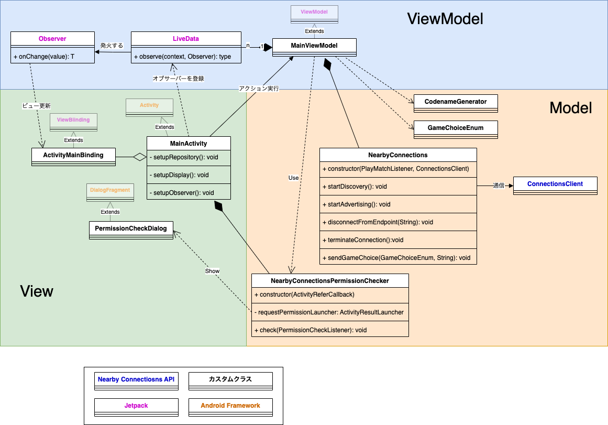

# hello-nearby-connections

Android Codelab「[インターネットを利用しない双方向通信](https://developer.android.com/codelabs/nearby-connections?hl=ja)」をベースにした [Nearby Connections API](https://developers.google.com/nearby/connections/overview?hl=ja#api_overview) のサンプルアプリ。

### Codelab との違い

- Android 12 以上に対応
- パーミッション拒否時にエラーダイアログを表示
- ```MainActvity``` の処理を MVVM に分解
  - ```ViewModel``` を適用
  - ```ViewBinding``` を適用
  - ```LiveData``` を適用
  - Nearby Connection API を使用した処理は Model クラス ```NearbyCoonectionNeabyConnections``` に実装
- ```Nearby#getConnectionsClient(Actvity)``` ではなく、```Nearby#getConnectionsClient(Context)``` を採用

### 画面

|  アプリ起動時  |  接続完了時  |  データ送受信完了時 |
| ------------ | ----------  | --------------   |
|    |  |  |

### クラス設計



### Nearby Connections API の動作イメージ

UMIDIGI 社端末と HUAWEI 社端末との間で通信した場合の Nearby Connection API の動作イメージ。  
  
お互いの Discovery が反応しているが有効なのは片方だけらしい。

### P2P_STAR の検証

UMIDIGI 社端末、 HUAWEI 社端末、NEXUS 5X の３端末で P2P_STAR トポロジを検証。
検証のため ```onConnectionResult``` における ```stopAdvertising``` と ```stopDiscovery``` の呼び出しをコメントアウトする。

```
override fun onConnectionResult(endpointId: String, result: ConnectionResolution) {
            Log.d(TAG, "onConnectionResult called [endpoint: " + endpointId + ", status: " + result.status + "]")
            if (result.status.isSuccess) {
     //           this@NearbyConnections.connectionsClientGetter.get().stopAdvertising()
     //           this@NearbyConnections.connectionsClientGetter.get().stopDiscovery()
                this@NearbyConnections.playMatchListener.onConnectWithOpponent(endpointId)
            }
        }
```

UMIDIGI 社端末をハブにした STAR 構造で接続されることを確認。  
  
- endpoint id は 接続を再開するたびに変更される。
- endpoint id は一つ接続に対し、１つ割り振られるので１つの端末で複数の endpoint id を持つ。